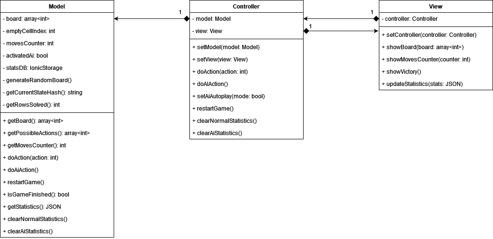
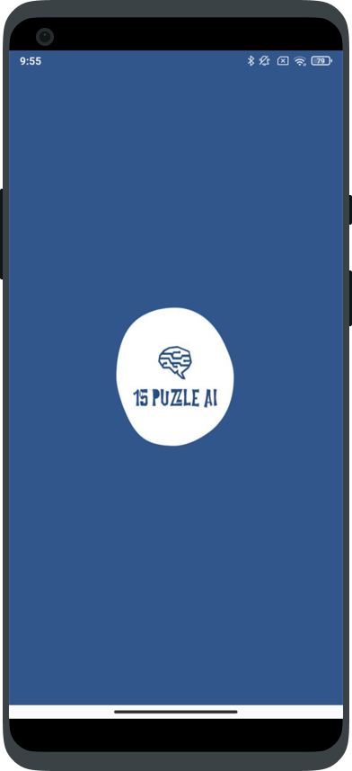
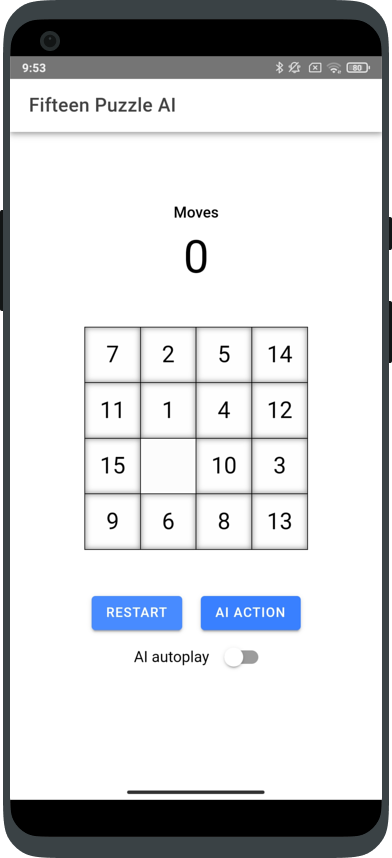

# FifteenPuzzleAI

The aim of this project is to develop a *mobile application* using a *cross platform framework*. The application I decided to build is an implementation of the *Fifteen Puzzle Game*. I decided not only to develop the game, but also to add an Artificial Intelligence Agent, trained using *Reinforcement Learning*, that can help the player to perform the next move or to play instead of the user for a while. 

## How to run - Web Browser

First of all you need to have installed ionic on your computer. Then type the following command in the terminal inside the project folder to run the application in the web browser:

```bash
npx ionic serve
```

## Class Diagram - MVC Pattern



## Screenshoots


