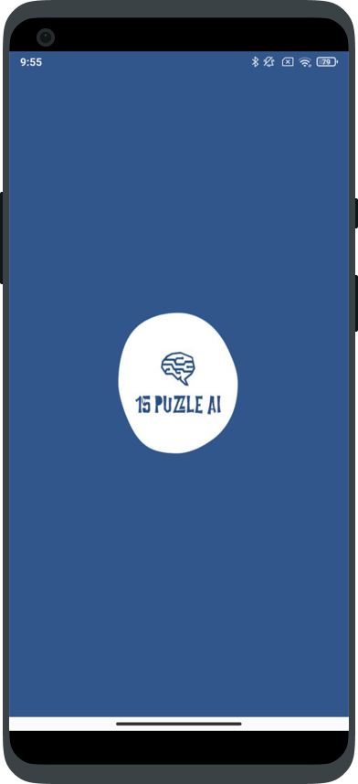
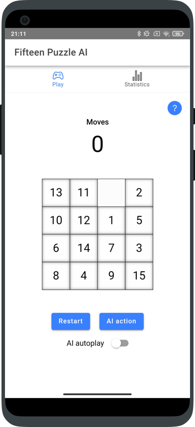
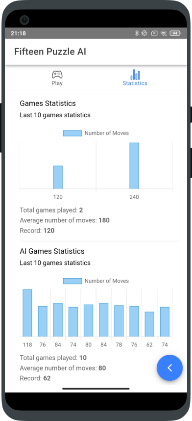

# FifteenPuzzleAI

The aim of this project is to develop a *mobile application* using a *cross platform framework*. The application I decided to build is an implementation of the *Fifteen Puzzle Game*. I decided not only to develop the game, but also to add an Artificial Intelligence Agent, trained using *Reinforcement Learning*, that can help the player to perform the next move or to play instead of the user for a while.

## Reinforcement Learning Policy

In  ```fifteenPuzzle_App/src/js``` there is a ```rl_policy.zip``` file that needs to be uncompressed before running the application in the *Web Browser*.

## How to run - Web Browser

First of all you need to have installed *Ionic* on your computer. Then type the following command in the terminal inside the project folder to run the application in the web browser:

```bash
npx ionic serve
```

## How to run - Android

In order to run on *Android* from your computer you need to have *Android Studio* installed. Then you have to run the following command inside the project folder. This command will build the Android application and will open *Android Studio*.

```bash
npx ionic capacitor build android
```

When *Android Studio* is opened you only need to build the project in *Android Studio* and run on a device.

## Class Diagram - MVC Pattern


## Screenshoots
<div>
  &nbsp;&nbsp;&nbsp;&nbsp;&nbsp;&nbsp;&nbsp;&nbsp;
  &nbsp;&nbsp;&nbsp;&nbsp;&nbsp;&nbsp;&nbsp;&nbsp;
  
</div>
